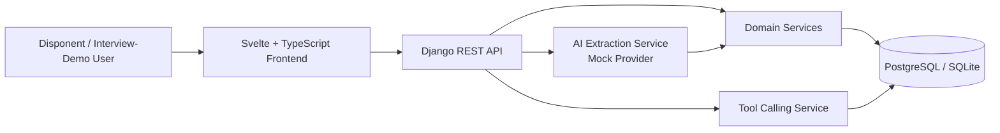

# Architekturuebersicht

LogiSense Demo Lite ist bewusst als kleiner, erklaerbarer Prototyp gebaut. Der Fokus liegt nicht auf maximaler Funktionsbreite, sondern auf einer sauberen Verbindung aus Datenmodell, API, UI und AI-Workflow.

## Backend-Schichten

| Schicht | Dateien | Aufgabe |
| --- | --- | --- |
| Models | `backend/tms/models.py` | Domänenobjekte und Beziehungen |
| Serializers | `backend/tms/serializers.py` | JSON-API-Repräsentation |
| Views | `backend/tms/views.py` | REST-Endpunkte und Request Handling |
| Services | `backend/tms/services/` | Businesslogik, AI-Extraktion, Validierung, Tool Routing |
| Tests | `backend/tms/tests/` | API- und AI-Workflow-Verifikation |

## Frontend-Schichten

| Schicht | Dateien | Aufgabe |
| --- | --- | --- |
| App Shell | `frontend/src/App.svelte` | Dashboard, Layout, Daten-Refresh |
| API Client | `frontend/src/lib/api.ts` | Einheitlicher Zugriff auf das Backend |
| UI Components | `frontend/src/components/` | Orders, Fahrzeuge, AI Assistant, Tool Query |
| Styling | `frontend/src/app.css` | Responsive Operational UI |

## Warum Mock AI?

Der Prototyp soll im Interview zuverlässig laufen, auch ohne API-Key oder Internet. Deshalb ist der Standardmodus `AI_MODE=mock`. Das System bleibt trotzdem AI-native strukturiert, weil der AI-Zugriff hinter `AIExtractionService` gekapselt ist. Ein echter Provider kann später hinter derselben Service-Schnittstelle ergänzt werden.
