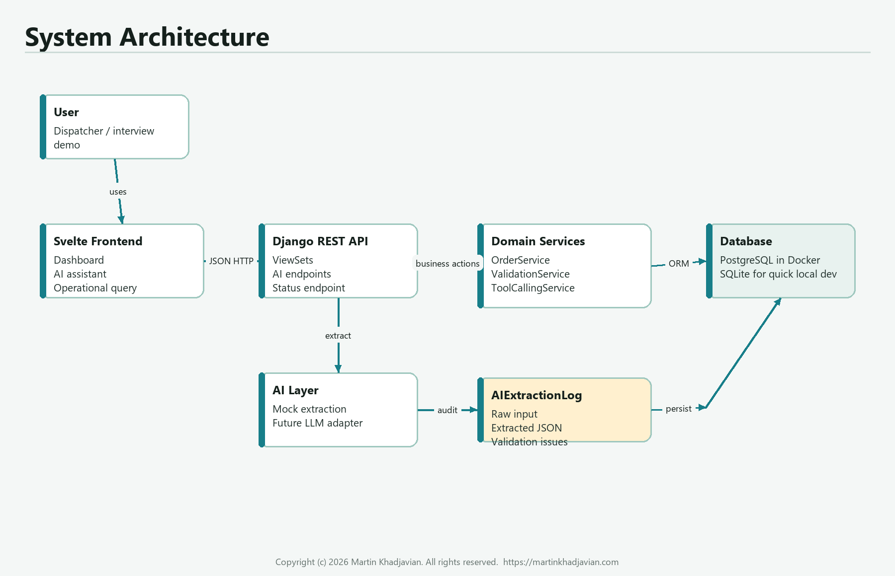
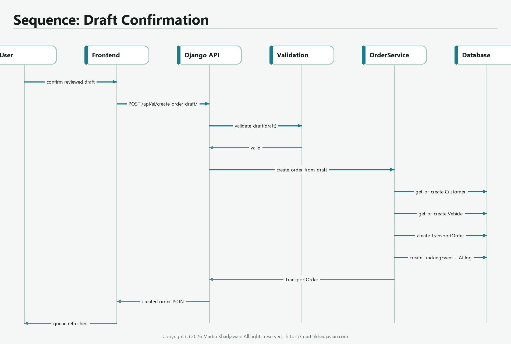
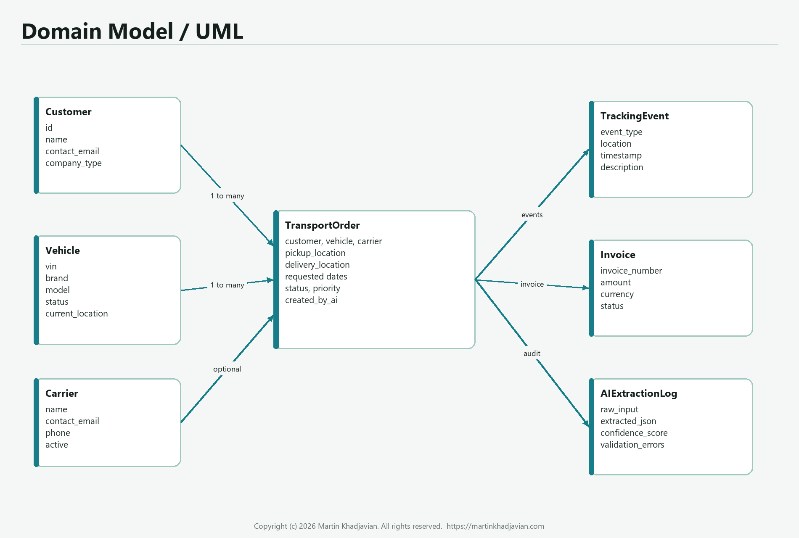
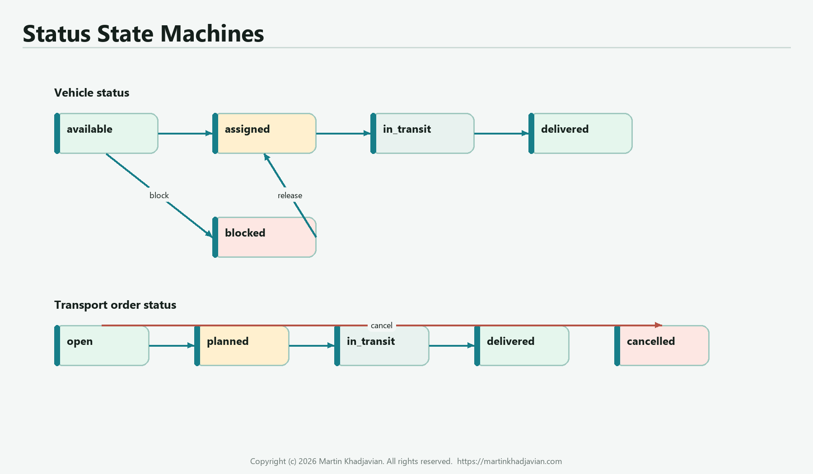
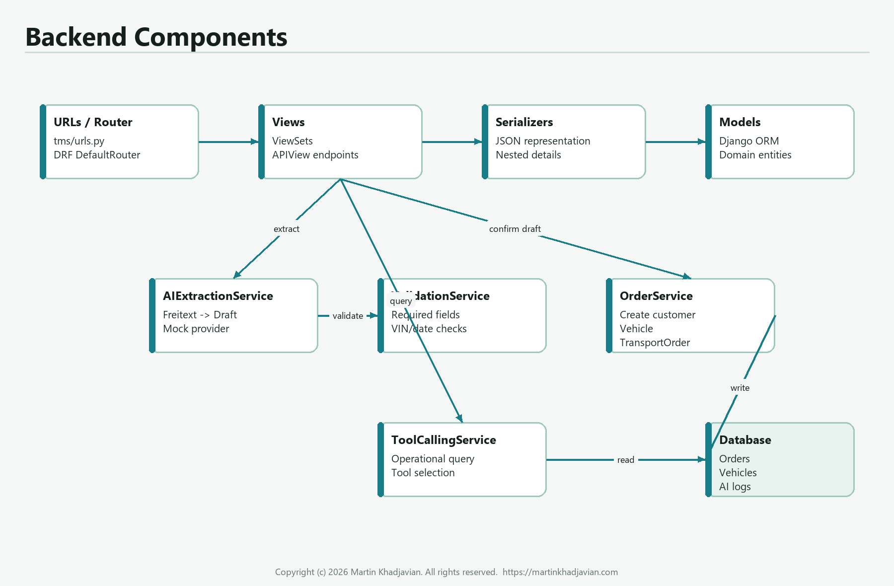
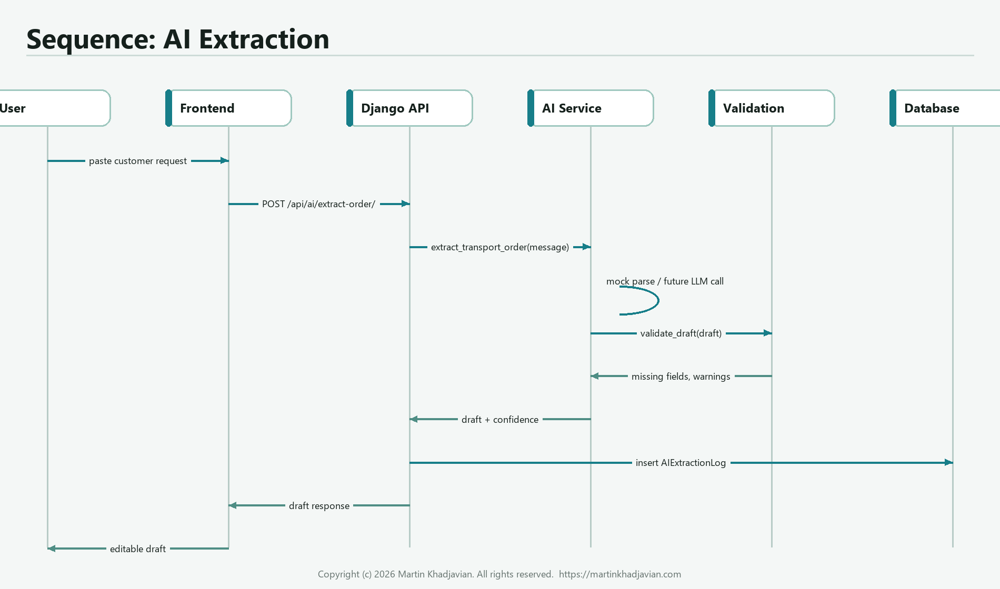
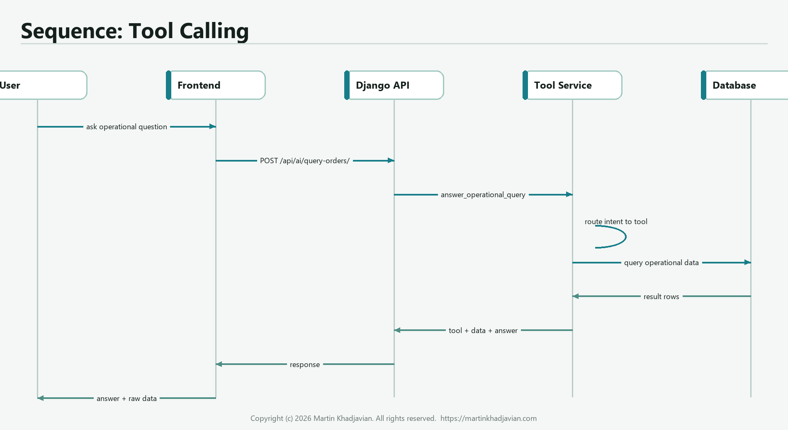
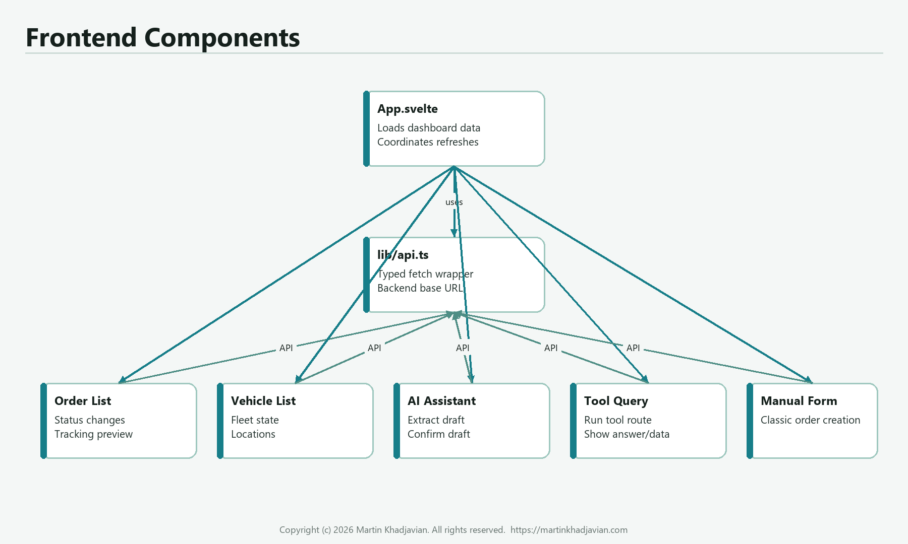
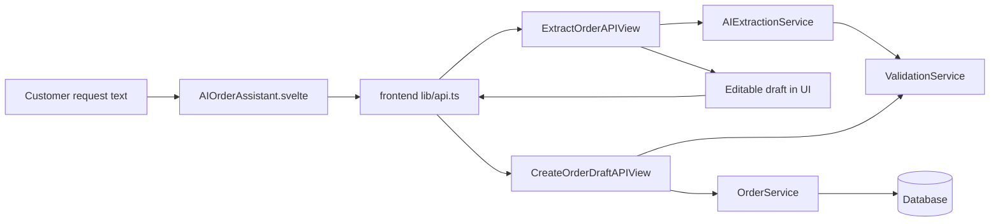
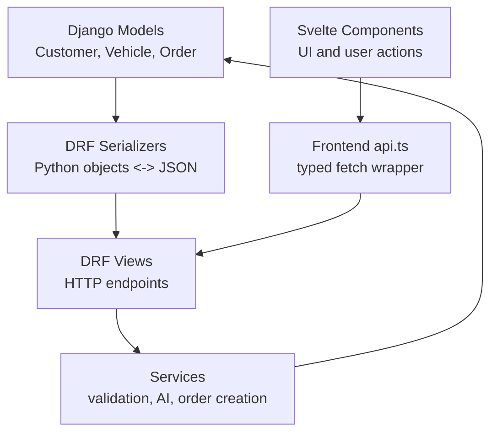

# Implementation Learning Manual

Copyright (c) 2026 Martin Khadjavian. All rights reserved.

Website: [martinkhadjavian.com](https://martinkhadjavian.com)

This second manual explains how LogiSense Demo Lite is integrated at code level. It is written so you can understand the architecture deeply enough to recreate the most important parts yourself without AI.

The goal is not to memorize every line. The goal is to understand the shape:

- data model first
- API layer second
- service layer for business logic
- frontend API client as the integration bridge
- UI components that call the API
- AI workflow as a controlled draft flow, not uncontrolled database writing

## 1. The Mental Model

Think of the project as five connected layers:



| Layer | What it does | Main files |
| --- | --- | --- |
| Domain model | Defines the business objects and relationships | `backend/tms/models.py` |
| API layer | Exposes data and workflows as HTTP JSON endpoints | `backend/tms/views.py`, `backend/tms/urls.py`, `backend/tms/serializers.py` |
| Service layer | Contains the important business logic | `backend/tms/services/` |
| Frontend integration | Calls backend endpoints in a typed way | `frontend/src/lib/api.ts`, `frontend/src/lib/types.ts` |
| UI components | Show operational screens and trigger workflows | `frontend/src/components/` |

The most important rule:

The frontend never writes directly to the database. The AI never writes directly to the database. Everything goes through the backend API and the domain services.

## 2. The End-to-End Request Path

When the user clicks "Extract", the request path is:

```text
AIOrderAssistant.svelte
  -> api.extractOrder(message)
    -> POST /api/ai/extract-order/
      -> ExtractOrderAPIView
        -> AIExtractionService
          -> ValidationService
            -> AIExtractionLog
              -> response to frontend
```

When the user clicks "Confirm Draft", the path is:

```text
AIOrderAssistant.svelte
  -> api.createOrderDraft(draft, rawInput, confidence)
    -> POST /api/ai/create-order-draft/
      -> CreateOrderDraftAPIView
        -> ValidationService
        -> OrderService
          -> Customer / Vehicle / TransportOrder / TrackingEvent
            -> response to frontend
```



## 3. How to Recreate the Backend Foundation

Start with the backend because the frontend needs a stable contract.

The build order is:

1. Create Django project and app.
2. Add models.
3. Create migrations.
4. Add serializers.
5. Add viewsets and custom API views.
6. Register URLs.
7. Add services.
8. Add tests.

## 4. The Domain Model

The domain model is the heart of the application. If you understand this model, the rest of the project becomes easier.



### 4.1 Why These Models Exist

| Model | Why it exists |
| --- | --- |
| `Customer` | The company or person requesting transport |
| `Vehicle` | The physical vehicle being transported |
| `Carrier` | Optional logistics provider carrying out transport |
| `TransportOrder` | The main business transaction |
| `TrackingEvent` | Status history for the order |
| `Invoice` | Commercial follow-up object |
| `AIExtractionLog` | Audit trail for AI extraction |

### 4.2 Core Pattern: Timestamp Base Class

File: `backend/tms/models.py`

```python
class TimeStampedModel(models.Model):
    created_at = models.DateTimeField(auto_now_add=True)
    updated_at = models.DateTimeField(auto_now=True)

    class Meta:
        abstract = True
```

Why it matters:

- Every important table gets `created_at` and `updated_at`.
- `abstract = True` means Django does not create a separate `TimeStampedModel` table.
- Other models inherit from it.

Recreate from memory:

```python
class TimeStampedModel(models.Model):
    created_at = models.DateTimeField(auto_now_add=True)
    updated_at = models.DateTimeField(auto_now=True)

    class Meta:
        abstract = True
```

### 4.3 Vehicle Model

File: `backend/tms/models.py`

```python
class Vehicle(TimeStampedModel):
    class Status(models.TextChoices):
        AVAILABLE = "available", "Available"
        ASSIGNED = "assigned", "Assigned"
        IN_TRANSIT = "in_transit", "In transit"
        DELIVERED = "delivered", "Delivered"
        BLOCKED = "blocked", "Blocked"

    vin = models.CharField(max_length=17, unique=True)
    brand = models.CharField(max_length=80)
    model = models.CharField(max_length=120)
    status = models.CharField(
        max_length=30,
        choices=Status.choices,
        default=Status.AVAILABLE,
    )
    current_location = models.CharField(max_length=255, blank=True)
```

Why it matters:

- `TextChoices` gives controlled status values.
- `vin` is unique because the VIN identifies a real vehicle.
- `status` lets the TMS know whether a vehicle can be planned.

What you should be able to rewrite yourself:

```python
class Vehicle(TimeStampedModel):
    class Status(models.TextChoices):
        AVAILABLE = "available", "Available"
        ASSIGNED = "assigned", "Assigned"

    vin = models.CharField(max_length=17, unique=True)
    brand = models.CharField(max_length=80)
    model = models.CharField(max_length=120)
    status = models.CharField(max_length=30, choices=Status.choices)
```

### 4.4 TransportOrder Model

File: `backend/tms/models.py`

```python
class TransportOrder(TimeStampedModel):
    class Status(models.TextChoices):
        OPEN = "open", "Open"
        PLANNED = "planned", "Planned"
        IN_TRANSIT = "in_transit", "In transit"
        DELIVERED = "delivered", "Delivered"
        CANCELLED = "cancelled", "Cancelled"

    customer = models.ForeignKey(
        Customer,
        on_delete=models.PROTECT,
        related_name="transport_orders",
    )
    vehicle = models.ForeignKey(
        Vehicle,
        on_delete=models.PROTECT,
        related_name="transport_orders",
    )
    pickup_location = models.CharField(max_length=255)
    delivery_location = models.CharField(max_length=255)
    status = models.CharField(
        max_length=30,
        choices=Status.choices,
        default=Status.OPEN,
    )
    created_by_ai = models.BooleanField(default=False)
```

Why it matters:

- `TransportOrder` is the core object.
- `customer` and `vehicle` are protected from deletion while orders exist.
- `created_by_ai` marks whether the order came from the AI workflow.

Important Django concept:

`on_delete=models.PROTECT` means: do not allow deleting a customer or vehicle if an order still references it.

This is correct for business data because transport orders should not silently lose their customer or vehicle.

## 5. Status Logic



The status model is simple but important:

```text
open -> planned -> in_transit -> delivered
open -> cancelled
```

Vehicle status is updated when the order status changes:

- when order becomes `in_transit`, vehicle becomes `in_transit`
- when order becomes `delivered`, vehicle becomes `delivered`
- when an AI draft is confirmed, vehicle becomes `assigned`

The key code is in `TransportOrderViewSet.update_status`.

File: `backend/tms/views.py`

```python
@action(detail=True, methods=["patch"], url_path="status")
def update_status(self, request, pk=None):
    order = self.get_object()
    next_status = request.data.get("status")
    valid_statuses = {choice[0] for choice in TransportOrder.Status.choices}

    if next_status not in valid_statuses:
        return Response(
            {"detail": f"Invalid status. Use one of: {sorted(valid_statuses)}"},
            status=status.HTTP_400_BAD_REQUEST,
        )

    order.status = next_status
    order.save(update_fields=["status", "updated_at"])
```

Then the vehicle state is synchronized:

```python
if next_status == TransportOrder.Status.IN_TRANSIT:
    order.vehicle.status = Vehicle.Status.IN_TRANSIT
    order.vehicle.save(update_fields=["status", "updated_at"])
elif next_status == TransportOrder.Status.DELIVERED:
    order.vehicle.status = Vehicle.Status.DELIVERED
    order.vehicle.current_location = order.delivery_location
    order.vehicle.save(update_fields=["status", "current_location", "updated_at"])
```

What to remember:

- validate the requested status first
- save the order
- then update dependent vehicle state
- return the serialized order

## 6. Serializers: Turning Models into JSON

Django models are Python objects. The frontend needs JSON. Serializers are the translation layer.

File: `backend/tms/serializers.py`

```python
class VehicleSerializer(serializers.ModelSerializer):
    class Meta:
        model = Vehicle
        fields = [
            "id",
            "vin",
            "brand",
            "model",
            "status",
            "current_location",
            "created_at",
            "updated_at",
        ]
        read_only_fields = ["created_at", "updated_at"]
```

For transport orders, the serializer exposes both IDs and readable nested details:

```python
class TransportOrderSerializer(serializers.ModelSerializer):
    customer_detail = CustomerSerializer(source="customer", read_only=True)
    vehicle_detail = VehicleSerializer(source="vehicle", read_only=True)

    class Meta:
        model = TransportOrder
        fields = [
            "id",
            "customer",
            "customer_detail",
            "vehicle",
            "vehicle_detail",
            "pickup_location",
            "delivery_location",
            "status",
            "priority",
            "created_by_ai",
        ]
```

Why this is useful:

- `customer` and `vehicle` IDs are useful for writes.
- `customer_detail` and `vehicle_detail` are useful for display.
- The frontend does not need a second request just to show customer name or VIN.

## 7. API Layer: ViewSets and Custom APIViews



### 7.1 ViewSet for Normal CRUD

File: `backend/tms/views.py`

```python
class VehicleViewSet(viewsets.ModelViewSet):
    queryset = Vehicle.objects.all()
    serializer_class = VehicleSerializer

    def get_queryset(self):
        queryset = super().get_queryset()
        vehicle_status = self.request.query_params.get("status")
        if vehicle_status:
            queryset = queryset.filter(status=vehicle_status)
        return queryset
```

What this gives you:

- `GET /api/vehicles/`
- `POST /api/vehicles/`
- `GET /api/vehicles/{id}/`
- `PUT/PATCH /api/vehicles/{id}/`
- `DELETE /api/vehicles/{id}/`
- optional filter: `/api/vehicles/?status=available`

### 7.2 APIView for a Workflow Endpoint

CRUD endpoints are for resources. Workflow endpoints are for actions.

AI extraction is an action, so it uses `APIView`.

File: `backend/tms/views.py`

```python
class ExtractOrderAPIView(APIView):
    def post(self, request):
        message = request.data.get("message", "")
        if not message.strip():
            return Response(
                {"detail": "message is required"},
                status=status.HTTP_400_BAD_REQUEST,
            )

        result = AIExtractionService().extract_transport_order(message)
```

Then the backend stores an audit log:

```python
AIExtractionLog.objects.create(
    raw_input=message,
    extracted_json=result.draft,
    confidence_score=Decimal(str(result.confidence)),
    validation_errors=result.validation_errors + result.missing_fields,
)
```

And returns the draft:

```python
return Response(
    {
        "draft": result.draft,
        "missing_fields": result.missing_fields,
        "validation_errors": result.validation_errors,
        "warnings": result.warnings,
        "confidence": result.confidence,
        "provider": result.provider,
    }
)
```

This pattern is worth memorizing:

```text
read request -> validate request -> call service -> persist audit if needed -> return JSON
```

### 7.3 URL Registration

File: `backend/tms/urls.py`

```python
router = DefaultRouter()
router.register("customers", CustomerViewSet)
router.register("vehicles", VehicleViewSet)
router.register("orders", TransportOrderViewSet, basename="orders")

urlpatterns = [
    path("", include(router.urls)),
    path("dashboard/", DashboardAPIView.as_view(), name="dashboard"),
    path("ai/extract-order/", ExtractOrderAPIView.as_view(), name="ai-extract-order"),
    path("ai/create-order-draft/", CreateOrderDraftAPIView.as_view(), name="ai-create-order-draft"),
    path("ai/query-orders/", QueryOrdersAPIView.as_view(), name="ai-query-orders"),
]
```

How to recreate:

- Use router for CRUD resources.
- Use explicit `path(...)` for custom workflows.

## 8. Service Layer: Why It Exists

Services keep views thin. Views should deal with HTTP. Services should deal with business logic.

The project has four important services:

| Service | Responsibility |
| --- | --- |
| `ValidationService` | decides whether draft data is acceptable |
| `AIExtractionService` | turns text into structured draft data |
| `OrderService` | writes confirmed draft data to the database |
| `ToolCallingService` | routes operational questions to database queries |

## 9. ValidationService

File: `backend/tms/services/validation_service.py`

```python
REQUIRED_DRAFT_FIELDS = [
    "customer_name",
    "vehicle_brand",
    "vehicle_model",
    "vin",
    "pickup_location",
    "delivery_location",
]
```

The result object is a dataclass:

```python
@dataclass
class DraftValidationResult:
    missing_fields: list[str]
    validation_errors: list[str]
    warnings: list[str]

    @property
    def is_valid(self) -> bool:
        return not self.missing_fields and not self.validation_errors
```

This is a clean pattern:

- return structured validation result
- avoid throwing exceptions for normal validation problems
- make `is_valid` easy to read

Core validation logic:

```python
missing_fields = [
    field
    for field in REQUIRED_DRAFT_FIELDS
    if not str(draft.get(field, "")).strip()
]
```

VIN validation:

```python
vin = str(draft.get("vin", "")).strip().upper()
if vin and not re.fullmatch(r"[A-HJ-NPR-Z0-9]{8,17}", vin):
    validation_errors.append(
        "VIN must contain 8 to 17 allowed alphanumeric characters without I, O or Q."
    )
```

Date validation:

```python
pickup = date.fromisoformat(str(pickup_date))
delivery = date.fromisoformat(str(delivery_date))
if delivery < pickup:
    validation_errors.append("Delivery date cannot be earlier than pickup date.")
```

What you should learn:

Validation should be central and reusable. Both `ExtractOrderAPIView` and `CreateOrderDraftAPIView` can use the same rules.

## 10. AIExtractionService



This service has a provider boundary:

File: `backend/tms/services/ai_extraction_service.py`

```python
def extract_transport_order(self, message: str) -> ExtractionResult:
    if settings.AI_MODE == "openai":
        return self._extract_with_openai(message)
    return self._extract_with_mock(message)
```

Why this is professional:

- local demo works without API keys
- future real LLM adapter can be added behind the same method
- views and frontend do not need to change

The output is a typed dataclass:

```python
@dataclass
class ExtractionResult:
    draft: dict[str, Any]
    missing_fields: list[str]
    validation_errors: list[str]
    warnings: list[str]
    confidence: float
    provider: str
```

The mock extractor builds a draft:

```python
draft: dict[str, Any] = {
    "customer_name": self._extract_customer(message),
    "vehicle_brand": None,
    "vehicle_model": None,
    "vin": self._extract_vin(message),
    "pickup_location": None,
    "delivery_location": None,
    "requested_pickup_date": None,
    "requested_delivery_date": None,
    "priority": self._extract_priority(message),
    "notes": message.strip(),
}
```

Then it fills vehicle, locations and dates:

```python
brand, model = self._extract_vehicle(message)
draft["vehicle_brand"] = brand
draft["vehicle_model"] = model

pickup, delivery = self._extract_locations(message)
draft["pickup_location"] = pickup
draft["delivery_location"] = delivery
```

Finally it validates:

```python
validation = ValidationService.validate_draft(draft)
confidence = self._calculate_confidence(draft, validation.validation_errors)
```

What to remember:

The extraction service should not save orders. It should return a draft plus validation metadata.

## 11. OrderService

File: `backend/tms/services/order_service.py`

This service turns a confirmed draft into real database records.

The most important decorator:

```python
@transaction.atomic
def create_order_from_draft(self, draft: dict[str, Any]) -> TransportOrder:
```

Why `transaction.atomic` matters:

If customer creation succeeds but order creation fails, the database should not be left half-changed. A transaction means all writes succeed together or roll back together.

Step 1: validate again.

```python
validation = ValidationService.validate_draft(draft)
if not validation.is_valid:
    details = validation.missing_fields + validation.validation_errors
    raise ValueError("; ".join(details))
```

Step 2: get or create customer.

```python
customer, _ = Customer.objects.get_or_create(
    name=draft["customer_name"].strip(),
    defaults={
        "contact_email": draft.get("customer_email", ""),
        "company_type": draft.get("company_type", "dealer"),
    },
)
```

Step 3: get or create vehicle.

```python
vehicle, created = Vehicle.objects.get_or_create(
    vin=draft["vin"].strip().upper(),
    defaults={
        "brand": draft["vehicle_brand"].strip(),
        "model": draft["vehicle_model"].strip(),
        "current_location": draft.get("pickup_location", ""),
        "status": Vehicle.Status.AVAILABLE,
    },
)
```

Step 4: create the transport order.

```python
order = TransportOrder.objects.create(
    customer=customer,
    vehicle=vehicle,
    pickup_location=draft["pickup_location"].strip(),
    delivery_location=draft["delivery_location"].strip(),
    requested_pickup_date=draft.get("requested_pickup_date") or None,
    requested_delivery_date=draft.get("requested_delivery_date") or None,
    priority=draft.get("priority", TransportOrder.Priority.NORMAL),
    notes=draft.get("notes", ""),
    created_by_ai=True,
)
```

Step 5: update vehicle and create first tracking event.

```python
vehicle.status = Vehicle.Status.ASSIGNED
vehicle.save(update_fields=["status", "updated_at"])

TrackingEvent.objects.create(
    transport_order=order,
    event_type=TrackingEvent.EventType.CREATED,
    location=order.pickup_location,
    timestamp=timezone.now(),
    description="Order draft was confirmed and created from AI extraction.",
)
```

This is one of the most important snippets in the whole project.

If you can recreate this service, you understand the backend workflow.

## 12. ToolCallingService



The tool-calling demo is deterministic. It is not a full LLM agent. It shows how agent-style routing works.

File: `backend/tms/services/tool_calling_service.py`

```python
def answer_operational_query(self, message: str) -> ToolResult:
    lowered = message.lower()
    if any(term in lowered for term in ["nicht disponiert", "unassigned", "available", "frei"]):
        return self._get_unassigned_vehicles()
    if any(term in lowered for term in ["offene", "open order", "open orders", "auftraege", "aufträge"]):
        return self._get_open_transport_orders()
    order_id = self._extract_order_id(message)
    if order_id:
        return self._get_tracking_status(order_id)
```

The important idea:

```text
natural language question -> choose tool -> query database -> return answer + raw data
```

Example tool:

```python
vehicles = list(
    Vehicle.objects.filter(status=Vehicle.Status.AVAILABLE)
    .order_by("brand", "model")
    .values("vin", "brand", "model", "current_location")
)
```

Why `.values(...)` is useful here:

- it returns dictionaries
- easy to serialize to JSON
- avoids exposing entire model objects

## 13. Frontend Integration



The frontend integration has three important files:

| File | Purpose |
| --- | --- |
| `frontend/src/lib/types.ts` | TypeScript shapes for backend JSON |
| `frontend/src/lib/api.ts` | fetch wrapper and API methods |
| `frontend/src/App.svelte` | loads data and passes it into components |

## 14. TypeScript Types

File: `frontend/src/lib/types.ts`

The type for a vehicle mirrors the backend serializer:

```ts
export type Vehicle = {
  id: number;
  vin: string;
  brand: string;
  model: string;
  status: string;
  current_location: string;
};
```

The order type includes nested details:

```ts
export type TransportOrder = {
  id: number;
  customer: number;
  customer_detail: Customer;
  vehicle: number;
  vehicle_detail: Vehicle;
  pickup_location: string;
  delivery_location: string;
  status: string;
  priority: string;
  created_by_ai: boolean;
};
```

Why this matters:

TypeScript types make frontend/backend integration visible. When the API changes, the UI code becomes easier to reason about.

## 15. API Client

File: `frontend/src/lib/api.ts`

The base URL:

```ts
const API_BASE_URL = import.meta.env.VITE_API_BASE_URL ?? 'http://localhost:8000/api';
```

The shared request wrapper:

```ts
async function request<T>(path: string, options: RequestInit = {}): Promise<T> {
  const response = await fetch(`${API_BASE_URL}${path}`, {
    headers: {
      'Content-Type': 'application/json',
      ...(options.headers ?? {})
    },
    ...options
  });

  if (!response.ok) {
    let message = `${response.status} ${response.statusText}`;
    const body = await response.json();
    message = body.detail ?? JSON.stringify(body);
    throw new Error(message);
  }

  return response.json() as Promise<T>;
}
```

Why this pattern is important:

- all API calls share the same error handling
- all calls return typed promises
- components stay clean

The AI methods:

```ts
extractOrder: (message: string) =>
  request<ExtractionResponse>('/ai/extract-order/', {
    method: 'POST',
    body: JSON.stringify({ message })
  }),

createOrderDraft: (draft: DraftOrder, rawInput: string, confidence: number) =>
  request<TransportOrder>('/ai/create-order-draft/', {
    method: 'POST',
    body: JSON.stringify({ draft, raw_input: rawInput, confidence })
  }),
```

This is the frontend/backend contract for the AI workflow.

## 16. App.svelte: Data Loading and Refresh

File: `frontend/src/App.svelte`

The app holds the main state:

```ts
let customers: Customer[] = [];
let vehicles: Vehicle[] = [];
let orders: TransportOrder[] = [];
let dashboard: Dashboard | null = null;
let loading = true;
let error = '';
```

The refresh function loads everything in parallel:

```ts
async function refresh() {
  loading = true;
  error = '';
  try {
    [dashboard, customers, vehicles, orders] = await Promise.all([
      api.getDashboard(),
      api.listCustomers(),
      api.listVehicles(),
      api.listOrders()
    ]);
  } catch (err) {
    error = err instanceof Error ? err.message : 'Backend not reachable';
  } finally {
    loading = false;
  }
}
```

Why `Promise.all` is good here:

- dashboard, customers, vehicles and orders are independent
- they can load in parallel
- the UI refresh is faster

The app passes data into components:

```svelte
<TransportOrderList {orders} on:changed={refresh} />
<VehicleList {vehicles} />
<AIOrderAssistant on:created={refresh} />
<OperationalQuery />
<ManualOrderForm {customers} {vehicles} on:created={refresh} />
```

Important frontend pattern:

Child components emit events like `created` or `changed`. The parent reloads data.

## 17. AIOrderAssistant.svelte

This component is the frontend heart of the AI workflow.

File: `frontend/src/components/AIOrderAssistant.svelte`

State:

```ts
let message = sample;
let result: ExtractionResponse | null = null;
let draft: DraftOrder | null = null;
let loading = false;
let saving = false;
let error = '';
let success = '';
```

Extract function:

```ts
async function extract() {
  loading = true;
  error = '';
  success = '';
  try {
    result = await api.extractOrder(message);
    draft = { ...result.draft };
  } catch (err) {
    error = err instanceof Error ? err.message : 'Extraction failed';
  } finally {
    loading = false;
  }
}
```

Confirm function:

```ts
async function createOrder() {
  if (!draft || !result) return;
  saving = true;
  error = '';
  success = '';
  try {
    const order = await api.createOrderDraft(draft, message, result.confidence);
    success = `Order #${order.id} created.`;
    dispatch('created');
  } catch (err) {
    error = err instanceof Error ? err.message : 'Draft creation failed';
  } finally {
    saving = false;
  }
}
```

Why `draft = { ...result.draft }` matters:

The component creates an editable copy of the backend draft. The user can change fields before saving.

The editable form:

```svelte
<label>
  Customer
  <input bind:value={draft.customer_name} />
</label>
<label>
  VIN
  <input bind:value={draft.vin} />
</label>
```

The confirmation button:

```svelte
<button class="primary-button" disabled={saving} on:click={createOrder}>
  <Check size={17} /> Confirm Draft
</button>
```

What to remember:

The frontend does not decide whether the draft is valid. It allows review and sends the draft back to the backend. The backend validates again.

## 18. Manual Order vs AI Order

The project has two ways to create an order:

| Flow | Frontend | Backend |
| --- | --- | --- |
| Manual | `ManualOrderForm.svelte` | `POST /api/orders/` |
| AI-assisted | `AIOrderAssistant.svelte` | `POST /api/ai/extract-order/`, then `POST /api/ai/create-order-draft/` |

Manual order is classic CRUD.

AI order is workflow-based:

```text
Freitext -> extraction -> validation -> editable draft -> confirmation -> persisted order
```

## 19. How the Pieces Fit Together



If you can draw this from memory, you understand the system.

## 20. Recreate the Backend Yourself

Use this as a no-AI exercise.

### Step 1: Create models

Write:

- `Customer`
- `Vehicle`
- `TransportOrder`
- `TrackingEvent`

Do not start with AI. First make normal TMS data work.

Minimum model relationships:

```python
class TransportOrder(models.Model):
    customer = models.ForeignKey(Customer, on_delete=models.PROTECT)
    vehicle = models.ForeignKey(Vehicle, on_delete=models.PROTECT)
    pickup_location = models.CharField(max_length=255)
    delivery_location = models.CharField(max_length=255)
    status = models.CharField(max_length=30, default="open")
```

### Step 2: Create serializers

Write one serializer per model:

```python
class CustomerSerializer(serializers.ModelSerializer):
    class Meta:
        model = Customer
        fields = "__all__"
```

Then improve it with explicit fields.

### Step 3: Create ViewSets

```python
class CustomerViewSet(viewsets.ModelViewSet):
    queryset = Customer.objects.all()
    serializer_class = CustomerSerializer
```

### Step 4: Register URLs

```python
router = DefaultRouter()
router.register("customers", CustomerViewSet)
router.register("vehicles", VehicleViewSet)
router.register("orders", TransportOrderViewSet)
```

### Step 5: Add status update endpoint

```python
@action(detail=True, methods=["patch"], url_path="status")
def update_status(self, request, pk=None):
    order = self.get_object()
    order.status = request.data["status"]
    order.save()
    return Response(self.get_serializer(order).data)
```

Then add validation around it.

## 21. Recreate the AI Workflow Yourself

### Step 1: Define the draft shape

```python
draft = {
    "customer_name": None,
    "vehicle_brand": None,
    "vehicle_model": None,
    "vin": None,
    "pickup_location": None,
    "delivery_location": None,
}
```

### Step 2: Validate required fields

```python
missing_fields = [
    field
    for field in REQUIRED_DRAFT_FIELDS
    if not str(draft.get(field, "")).strip()
]
```

### Step 3: Create extraction endpoint

```python
class ExtractOrderAPIView(APIView):
    def post(self, request):
        message = request.data.get("message", "")
        result = AIExtractionService().extract_transport_order(message)
        return Response({"draft": result.draft})
```

### Step 4: Create confirmation endpoint

```python
class CreateOrderDraftAPIView(APIView):
    def post(self, request):
        draft = request.data["draft"]
        order = OrderService().create_order_from_draft(draft)
        return Response(TransportOrderSerializer(order).data, status=201)
```

### Step 5: Add audit log

```python
AIExtractionLog.objects.create(
    raw_input=message,
    extracted_json=result.draft,
    confidence_score=result.confidence,
)
```

This is the moment where the project becomes enterprise-like instead of just a toy demo.

## 22. Recreate the Frontend Yourself

### Step 1: Create an API client

```ts
async function request<T>(path: string, options: RequestInit = {}): Promise<T> {
  const response = await fetch(`${API_BASE_URL}${path}`, options);
  if (!response.ok) {
    throw new Error(`${response.status} ${response.statusText}`);
  }
  return response.json() as Promise<T>;
}
```

### Step 2: Add API methods

```ts
export const api = {
  listOrders: () => request<TransportOrder[]>('/orders/'),
  extractOrder: (message: string) =>
    request<ExtractionResponse>('/ai/extract-order/', {
      method: 'POST',
      body: JSON.stringify({ message }),
      headers: { 'Content-Type': 'application/json' }
    })
};
```

### Step 3: Load data in the app

```ts
onMount(refresh);
```

### Step 4: Create AI component state

```ts
let message = '';
let result: ExtractionResponse | null = null;
let draft: DraftOrder | null = null;
```

### Step 5: Call backend on button click

```ts
async function extract() {
  result = await api.extractOrder(message);
  draft = { ...result.draft };
}
```

## 23. The Most Important Things to Memorize

If you want to recreate this architecture in an interview or coding task, memorize these patterns.

### Django model relationship

```python
customer = models.ForeignKey(Customer, on_delete=models.PROTECT)
vehicle = models.ForeignKey(Vehicle, on_delete=models.PROTECT)
```

### DRF serializer

```python
class VehicleSerializer(serializers.ModelSerializer):
    class Meta:
        model = Vehicle
        fields = ["id", "vin", "brand", "model", "status"]
```

### DRF ViewSet

```python
class VehicleViewSet(viewsets.ModelViewSet):
    queryset = Vehicle.objects.all()
    serializer_class = VehicleSerializer
```

### Custom APIView

```python
class ExtractOrderAPIView(APIView):
    def post(self, request):
        message = request.data.get("message", "")
        result = AIExtractionService().extract_transport_order(message)
        return Response({"draft": result.draft})
```

### Transactional service

```python
@transaction.atomic
def create_order_from_draft(self, draft):
    customer, _ = Customer.objects.get_or_create(name=draft["customer_name"])
    vehicle, _ = Vehicle.objects.get_or_create(vin=draft["vin"])
    return TransportOrder.objects.create(customer=customer, vehicle=vehicle)
```

### Frontend fetch wrapper

```ts
async function request<T>(path: string, options: RequestInit = {}): Promise<T> {
  const response = await fetch(`${API_BASE_URL}${path}`, options);
  if (!response.ok) throw new Error(response.statusText);
  return response.json() as Promise<T>;
}
```

### Svelte event pattern

```svelte
<AIOrderAssistant on:created={refresh} />
```

Child component:

```ts
dispatch('created');
```

## 24. Common Mistakes and How to Avoid Them

### Mistake 1: Letting AI write directly to the database

Bad:

```text
User text -> AI -> database
```

Good:

```text
User text -> AI draft -> validation -> human review -> database
```

### Mistake 2: Putting all logic in views

Bad:

```python
class CreateOrderDraftAPIView(APIView):
    def post(self, request):
        # 80 lines of validation, parsing and database writes
```

Good:

```python
validation = ValidationService.validate_draft(draft)
order = OrderService().create_order_from_draft(draft)
```

### Mistake 3: Making the frontend know too much

The frontend should not decide business rules like VIN validity or status transitions. It should show validation feedback and send user actions to the backend.

### Mistake 4: No audit trail

For AI workflows, always keep:

- raw input
- extracted output
- confidence
- validation issues
- created order if confirmed

That is why `AIExtractionLog` exists.

## 25. How to Explain This in an Interview

Use this structure:

1. "I started with the domain model: customer, vehicle, transport order, tracking."
2. "Then I exposed the domain through DRF serializers and viewsets."
3. "For AI, I intentionally used a draft workflow: extraction, validation, human confirmation."
4. "The service layer keeps the code explainable and testable."
5. "The Svelte frontend consumes the API through a typed client."
6. "Tool calling is demonstrated as a deterministic router that can later become MCP-style tools."

Short version:

```text
The project is not just a chatbot. The AI is embedded into a real data workflow.
It proposes structured data, the backend validates it, and the user confirms it.
```

## 26. Build-It-Yourself Checklist

Use this as your practice checklist.

- Create Django project.
- Create `tms` app.
- Add `Customer`, `Vehicle`, `TransportOrder`, `TrackingEvent`.
- Run migrations.
- Add serializers.
- Add ViewSets.
- Add router URLs.
- Test CRUD in browser.
- Add `ValidationService`.
- Add `AIExtractionService`.
- Add `ExtractOrderAPIView`.
- Add `OrderService`.
- Add `CreateOrderDraftAPIView`.
- Add `ToolCallingService`.
- Create Svelte app.
- Create `types.ts`.
- Create `api.ts`.
- Create order list component.
- Create AI assistant component.
- Test end-to-end.

## 27. Minimum Version You Should Be Able to Write From Scratch

If you want to prove to yourself that you understand the system, rebuild this minimum version:

Backend:

- `Customer`
- `Vehicle`
- `TransportOrder`
- `VehicleSerializer`
- `TransportOrderSerializer`
- `VehicleViewSet`
- `TransportOrderViewSet`
- `ExtractOrderAPIView`
- `CreateOrderDraftAPIView`

Frontend:

- `api.ts`
- one order list
- one textarea
- one extract button
- one confirm button

That smaller version already demonstrates the architecture.

## 28. Final Architecture Memory Diagram



Memorize this diagram. It is the whole project in one picture.
