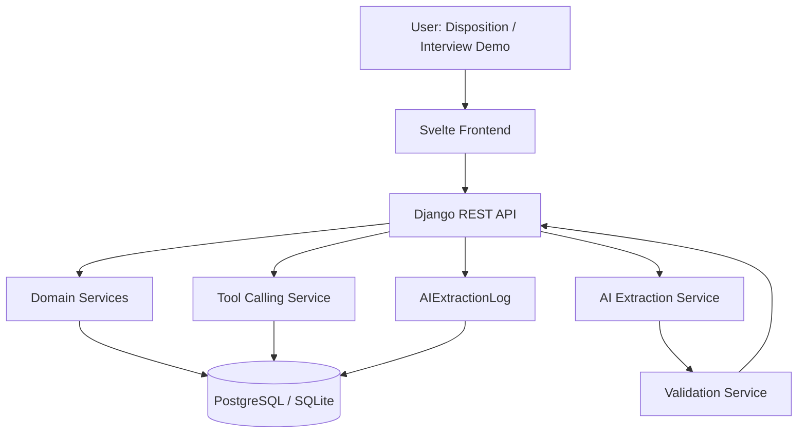
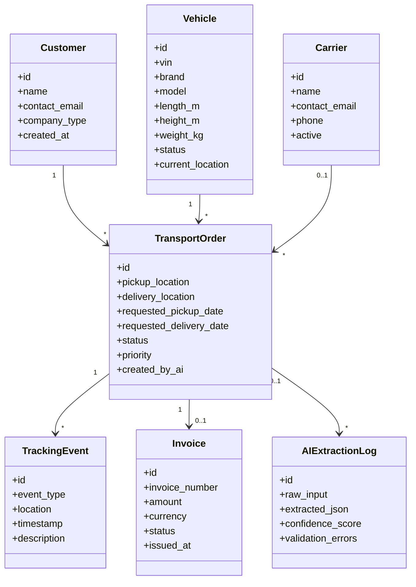
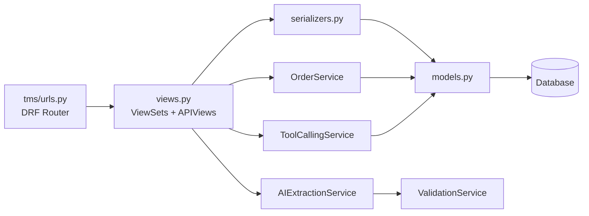
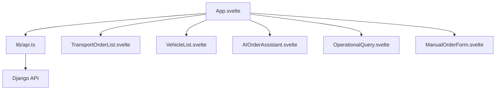
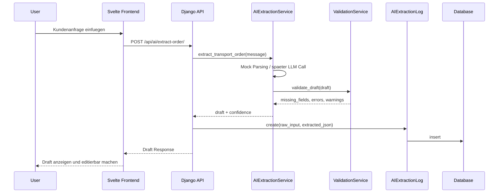
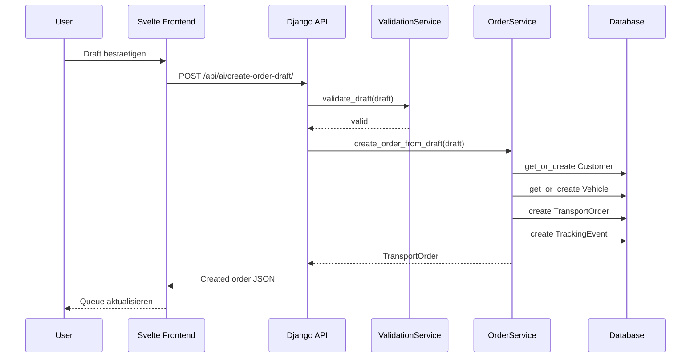
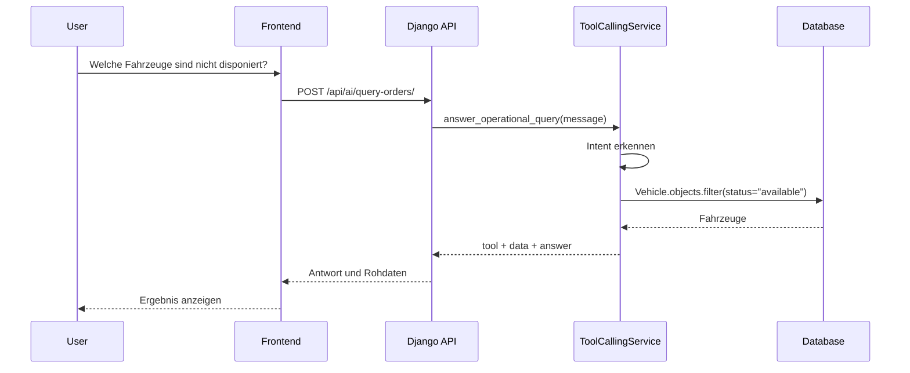
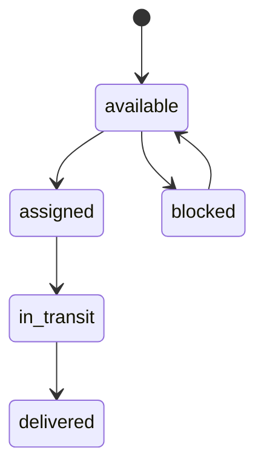
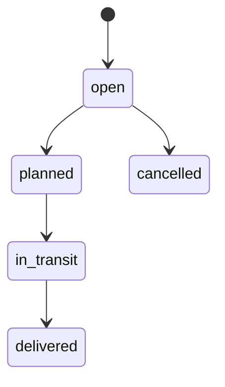

# Handbuch: LogiSense Demo Lite

Dieses Handbuch erklärt das Demo-Projekt vollständig: fachliche Idee, Architektur, Datenmodell, API, AI-Workflow, Tool-Calling-Konzept, Setup, Tests und Interview-Nutzung.

## 1. Ziel des Projekts

LogiSense Demo Lite ist ein kleiner AI-native TMS-Prototyp für die Fahrzeuglogistik. Ein TMS, also Transport Management System, verwaltet Transportaufträge, Fahrzeuge, Kunden, Statuswechsel und Tracking-Informationen.

Das besondere Demo-Feature ist der AI-Workflow:

Ein User schreibt eine unstrukturierte Kundenanfrage. Das System extrahiert daraus strukturierte Auftragsdaten, validiert diese Daten und legt erst nach menschlicher Bestätigung einen Transportauftrag an.

Der Prototyp zeigt damit:

- Domänenverständnis für Fahrzeuglogistik
- Datenmodellierung mit Django und relationaler Datenbank
- REST API mit Django REST Framework
- Svelte/TypeScript UI
- AI-native Workflow-Integration
- Tool-Calling-Denken für operative Datenfragen
- Nachvollziehbarkeit durch `AIExtractionLog`

## 2. Technischer Stack

| Bereich | Technologie | Zweck |
| --- | --- | --- |
| Backend | Django | Web Framework und Domänenlogik |
| API | Django REST Framework | JSON-Endpunkte für Frontend und AI-Workflow |
| Datenbank | PostgreSQL / SQLite | Persistenz; Docker nutzt PostgreSQL, lokale Entwicklung kann SQLite nutzen |
| Frontend | Svelte + TypeScript | Interaktive operative Oberfläche |
| AI Layer | Mock AI Service | Deterministische Extraktion ohne API-Key |
| DevOps | Docker Compose | Start von PostgreSQL, Backend und Frontend |
| Tests | pytest / pytest-django | Backend-Verifikation |
| Docs | Markdown, Mermaid, PlantUML | Erklärbarkeit und Interviewfähigkeit |

## 3. Gesamtarchitektur



Die wichtigste Architekturentscheidung ist die Trennung zwischen Vorschlag und Persistenz:

- Die AI extrahiert einen Draft.
- Die Validierung prüft Pflichtfelder, VIN und Datumslogik.
- Der Mensch kann Felder korrigieren.
- Erst danach erstellt `OrderService` echte Datenbankobjekte.

## 4. Projektstruktur

```text
.
├── backend/
│   ├── config/
│   ├── tms/
│   │   ├── models.py
│   │   ├── serializers.py
│   │   ├── views.py
│   │   ├── urls.py
│   │   ├── services/
│   │   ├── management/commands/seed_demo.py
│   │   └── tests/
│   ├── Dockerfile
│   ├── manage.py
│   └── requirements.txt
├── frontend/
│   ├── src/
│   │   ├── components/
│   │   ├── lib/
│   │   ├── App.svelte
│   │   └── app.css
│   ├── Dockerfile
│   └── package.json
├── ai/
│   ├── prompts/
│   └── examples/
├── docs/
│   ├── plantuml/
│   ├── architecture.md
│   ├── interview_pitch.md
│   └── manual.md
├── docker-compose.yml
├── .env.example
└── README.md
```

## 5. Datenmodell



### Customer

Kunde oder Auftraggeber. Im Demo-Kontext sind das zum Beispiel Autohaus, OEM, Fleet- oder Rental-Unternehmen.

### Vehicle

Fahrzeug mit VIN, Marke, Modell, Maßen, Status und aktuellem Standort. Der Status kann zum Beispiel `available`, `assigned`, `in_transit` oder `delivered` sein.

### TransportOrder

Zentrales Objekt des TMS. Es verbindet Kunde, Fahrzeug, optional Carrier, Route, Wunschdaten, Status, Priorität und AI-Herkunft.

### TrackingEvent

Zeitliche Ereignisse zum Auftrag: erstellt, Abholung geplant, abgeholt, unterwegs, geliefert oder Ausnahme.

### AIExtractionLog

Audit-Objekt. Es speichert Rohtext, extrahiertes JSON, Confidence und Validierungsprobleme. Dadurch ist nachvollziehbar, was die AI vorgeschlagen hat.

## 6. Backend-Komponenten



### `models.py`

Definiert die Datenbanktabellen und Beziehungen. Django erzeugt daraus Migrationen und ORM-Klassen.

### `serializers.py`

Wandelt Django-Modelle in JSON und JSON in Django-Modelle. Das Frontend bekommt dadurch saubere API-Objekte.

### `views.py`

Enthält CRUD-Endpunkte und Spezial-Endpunkte:

- `/api/dashboard/`
- `/api/ai/extract-order/`
- `/api/ai/create-order-draft/`
- `/api/ai/query-orders/`
- `/api/orders/{id}/status/`

### `services/`

Hier liegt bewusst die eigentliche Businesslogik. Das ist sauberer als alles direkt in Views zu schreiben.

| Service | Aufgabe |
| --- | --- |
| `AIExtractionService` | Freitext in strukturierten Draft umwandeln |
| `ValidationService` | Pflichtfelder, VIN und Datumslogik prüfen |
| `OrderService` | geprüften Draft in echte Objekte umwandeln |
| `ToolCallingService` | einfache Tool-Auswahl für operative Fragen |

## 7. Frontend-Komponenten



Das Frontend ist als operative Oberfläche gebaut:

- Kennzahlen oben
- Order Queue links
- Fahrzeuge darunter
- AI Assistant rechts
- Tool-Calling-Abfrage rechts
- Manuelle Auftragserstellung rechts

## 8. AI-Extraktionsworkflow



### Warum speichert die AI nicht direkt?

In produktionsnaher Enterprise-Software sollte eine AI keine ungeprüften Stammdaten oder Aufträge schreiben. Das Demo zeigt deshalb ein professionelles Muster:

1. AI extrahiert.
2. Backend validiert.
3. Mensch prüft.
4. Domain Service speichert.
5. Audit Log dokumentiert.

## 9. Draft-Bestaetigung



## 10. Tool Calling

Die Tool-Calling-Demo ist bewusst klein und deterministisch. Sie zeigt das Prinzip, ohne einen vollständigen MCP Server bauen zu müssen.



Aktuelle Demo-Tools:

| Tool | Zweck |
| --- | --- |
| `get_unassigned_vehicles` | verfügbare, nicht disponierte Fahrzeuge anzeigen |
| `get_open_transport_orders` | offene/geplante Aufträge anzeigen |
| `get_tracking_status` | Status und letztes Tracking zu einem Auftrag anzeigen |

## 11. API-Endpunkte

### Stammdaten und Aufträge

| Methode | Pfad | Zweck |
| --- | --- | --- |
| GET | `/api/customers/` | Kunden listen |
| POST | `/api/customers/` | Kunde anlegen |
| GET | `/api/vehicles/` | Fahrzeuge listen |
| POST | `/api/vehicles/` | Fahrzeug anlegen |
| GET | `/api/orders/` | Transportaufträge listen |
| POST | `/api/orders/` | Transportauftrag manuell anlegen |
| PATCH | `/api/orders/{id}/status/` | Auftragsstatus ändern |
| GET | `/api/tracking-events/` | Tracking Events listen |
| POST | `/api/tracking-events/` | Tracking Event anlegen |

### AI und Tool Calling

| Methode | Pfad | Zweck |
| --- | --- | --- |
| POST | `/api/ai/extract-order/` | Freitext zu Draft extrahieren |
| POST | `/api/ai/create-order-draft/` | geprüften Draft speichern |
| POST | `/api/ai/query-orders/` | operative Frage per Tool beantworten |
| GET | `/api/ai/logs/` | AI Logs lesen |

### Beispiel: AI Extraction Request

```json
{
  "message": "Bitte transportieren Sie einen BMW i4 mit VIN WBA123456789ABCDE von Duesseldorf nach Muenchen. Abholung am 12.06.2026, Lieferung bis 14.06.2026. Kunde ist Autohaus Mueller."
}
```

### Beispiel: AI Extraction Response

```json
{
  "draft": {
    "customer_name": "Autohaus Mueller",
    "vehicle_brand": "BMW",
    "vehicle_model": "i4",
    "vin": "WBA123456789ABCDE",
    "pickup_location": "Duesseldorf",
    "delivery_location": "Muenchen",
    "requested_pickup_date": "2026-06-12",
    "requested_delivery_date": "2026-06-14",
    "priority": "normal"
  },
  "missing_fields": [],
  "validation_errors": [],
  "confidence": 0.99,
  "provider": "mock"
}
```

## 12. Lokales Setup ohne Docker

### Backend

```powershell
cd backend
python -m venv .venv
.\.venv\Scripts\Activate.ps1
pip install -r requirements.txt
python manage.py migrate
python manage.py seed_demo
python manage.py runserver 8000
```

Backend läuft dann auf:

```text
http://localhost:8000/api/
```

### Frontend

```powershell
cd frontend
npm install
npm run dev
```

Frontend läuft dann auf:

```text
http://localhost:5173
```

## 13. Setup mit Docker

```powershell
docker compose up --build
```

Services:

| Service | Port | Aufgabe |
| --- | --- | --- |
| `db` | 5432 | PostgreSQL |
| `backend` | 8000 | Django API |
| `frontend` | 5173 | Svelte Dev Server |

Docker nutzt PostgreSQL. Ohne Docker nutzt das Backend automatisch SQLite, solange `POSTGRES_HOST` leer ist.

## 14. Tests und Qualität

Backend-Tests:

```powershell
cd backend
pytest
```

Frontend-Build:

```powershell
cd frontend
npm run build
```

Die Tests prüfen:

- Mock-AI-Extraktion
- manuelle Auftragserstellung per API
- Draft-Erstellung aus AI-Daten
- Tool-Calling-Endpunkt für nicht disponierte Fahrzeuge

## 15. Statusmodell

### Vehicle Status



### Transport Order Status



## 16. Validierung

Pflichtfelder eines AI-Drafts:

- `customer_name`
- `vehicle_brand`
- `vehicle_model`
- `vin`
- `pickup_location`
- `delivery_location`

Zusätzliche Prüfungen:

- VIN ist alphanumerisch und nutzt keine typischen verbotenen VIN-Zeichen `I`, `O`, `Q`.
- Demo akzeptiert VINs mit 8 bis 17 Zeichen, warnt aber bei nicht exakt 17 Zeichen.
- Lieferdatum darf nicht vor Abholdatum liegen.
- Datumswerte müssen ISO-Format `YYYY-MM-DD` haben, sobald sie gespeichert werden.

## 17. Sicherheit und Produktreife

Dieses Demo ist absichtlich klein, zeigt aber produktionsnahe Denkmuster:

- AI schreibt nicht direkt ungeprüft in die Datenbank.
- API und Domain Services validieren vor Persistenz.
- AI-Vorschläge werden geloggt.
- Statusänderungen laufen über kontrollierte Endpunkte.
- PostgreSQL ist per Docker reproduzierbar.
- Secrets gehören in `.env`, nicht ins Repository.

Was in einer echten Produktion ergänzt würde:

- Authentifizierung und Rollenrechte
- echte LLM-Provider-Integration
- Rate Limits und Audit Logs pro User
- bessere VIN-Validierung inklusive Check Digit
- asynchrone Jobs für längere AI-Calls
- Observability mit Logs, Traces und Metriken
- Import-/Export-Schnittstellen zu ERP, Carrier APIs und Telematik

## 18. PlantUML-Dateien

Die PlantUML-Quellen liegen in:

```text
docs/plantuml/
```

Empfohlene Render-Befehle:

```powershell
plantuml docs/plantuml/*.puml
```

oder online über einen PlantUML-Renderer.

## 19. Typischer Interview-Erklärpfad

1. "Ich habe klein gebaut, aber bewusst domänennah."
2. "Das Datenmodell bildet die TMS-Kernobjekte ab."
3. "Die API trennt CRUD, Statuswechsel und AI-Endpunkte."
4. "Die AI erzeugt nur Vorschläge, keine ungeprüften Schreiboperationen."
5. "Der Mock-AI-Modus macht die Demo stabil und reproduzierbar."
6. "Tool Calling zeigt, wie ein Agent operative Daten sicher abfragen könnte."
7. "Nächste Ausbaustufe wäre ein echter LLM-Provider und ein MCP Server."

## 20. Troubleshooting

### Frontend meldet `Backend not reachable`

Prüfen:

```powershell
cd backend
python manage.py runserver 8000
```

Dann im Browser öffnen:

```text
http://localhost:8000/api/dashboard/
```

### Keine Daten sichtbar

Seed-Daten anlegen:

```powershell
cd backend
python manage.py seed_demo
```

### Migration fehlt

```powershell
cd backend
python manage.py migrate
```

### CORS-Problem

Prüfen, ob `.env` oder Docker Compose diese Origin enthält:

```text
CORS_ALLOWED_ORIGINS=http://localhost:5173,http://127.0.0.1:5173
```

## 21. Erweiterungsideen

Sinnvolle nächste Schritte:

- echter LLM Adapter in `AIExtractionService._extract_with_openai`
- strukturierte JSON-Schema-Validierung
- MCP Server mit Tools wie `get_unassigned_vehicles`
- Carrier-Zuweisung mit Kapazitäten
- ETA-Berechnung und einfache Routenlogik
- CSV/JSON Import für Fahrzeuglisten
- Authentifizierung mit Rollen `dispatcher`, `admin`, `viewer`
- End-to-End Tests mit Playwright

## 22. Copyright

Copyright (c) 2026 Martin Khadjavian. All rights reserved.

Website: [martinkhadjavian.com](https://martinkhadjavian.com)
